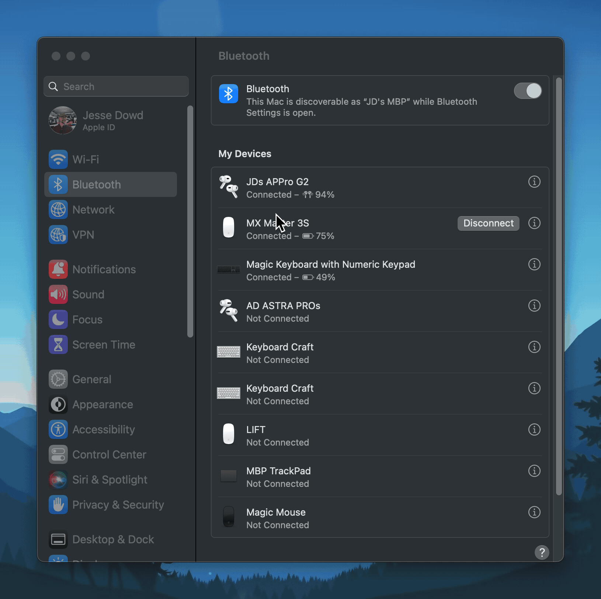
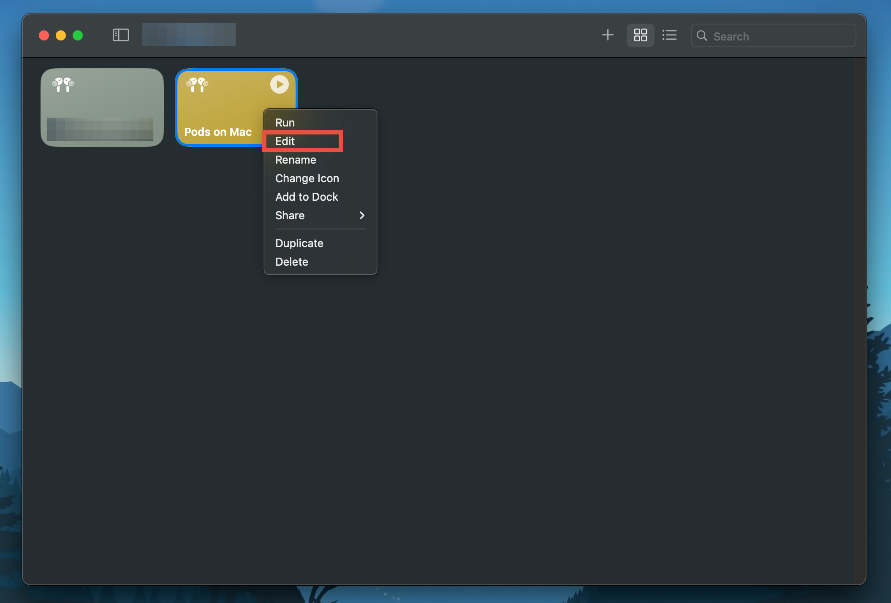
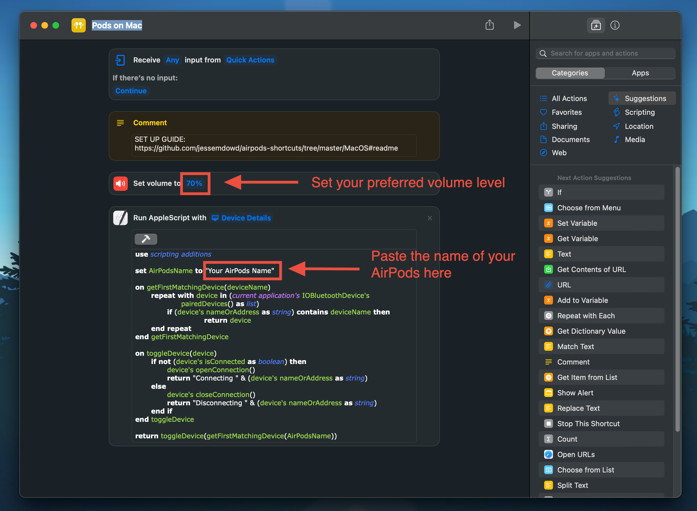
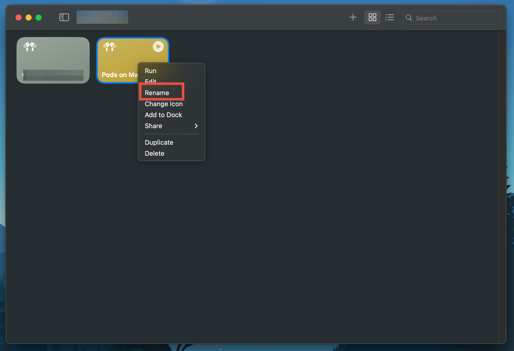
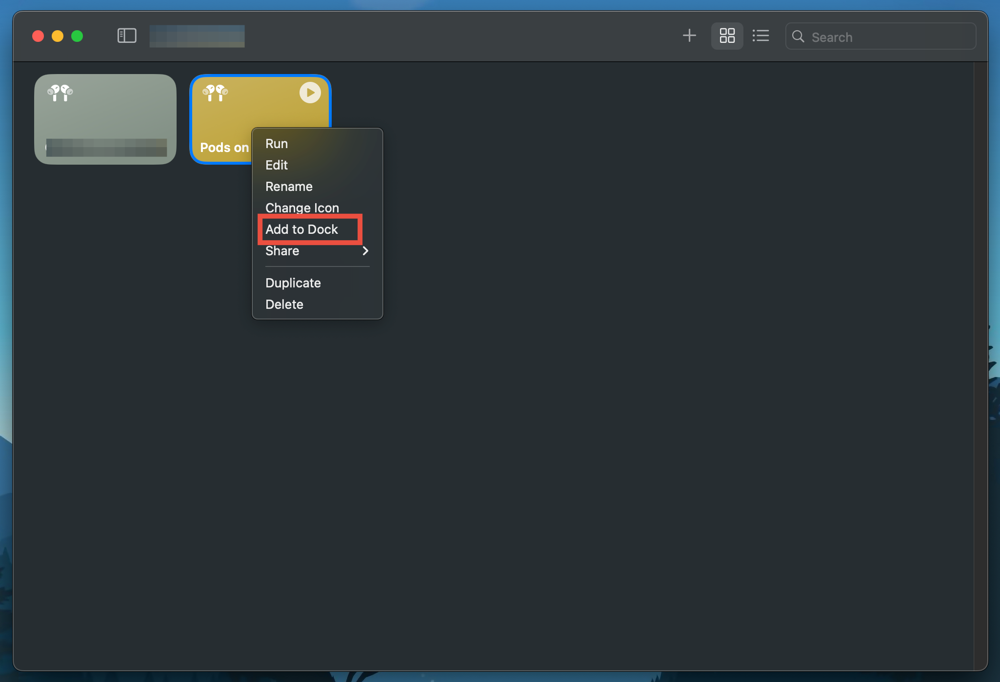
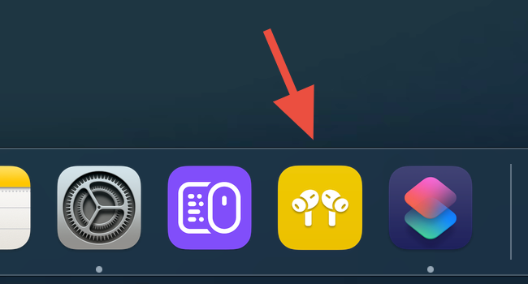
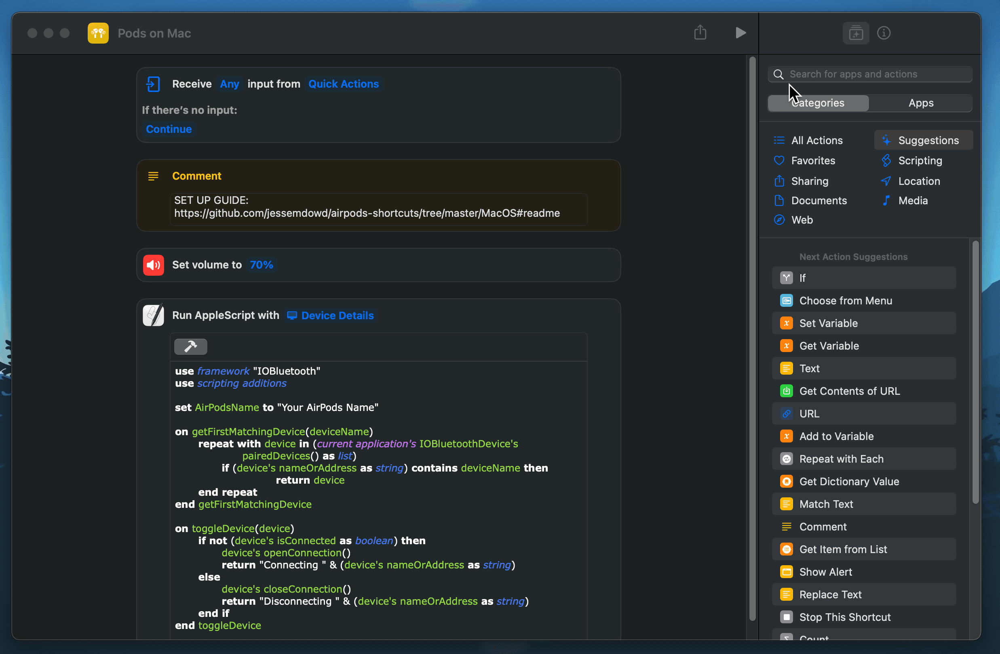

# MacOS AirPods Connection Shortcut
Built for **Macs**

- [MacOS AirPods Connection Shortcut](#macos-airpods-connection-shortcut)
    - [About](#about)
    - [Recommended Setup](#recommended-setup)
    - [Customization](#customization)
      - [Rename Shortcut to your own Siri Command](#rename-shortcut-to-your-own-siri-command)
      - [Add To Dock](#add-to-dock)
      - [Create A Keyboard Shortcut](#create-a-keyboard-shortcut)

### About
This shortcut is a 1-Click and Siri Command solution for quickly toggling your AirPods connection on a Mac.

Why?
> I grew tired of my devices competing for the connection. When sitting down at the computer, I wished I could just quickly lock-in the connection while I worked.

### Recommended Setup

1. Connect AirPods & access their settings from `System Settings`
   1. Set Connect to this Mac to `When last connected to this mac`
   2. Copy the name of your AirPods (You'll need to past this in the shortcut)

2. [Download the Shortcut](https://www.icloud.com/shortcuts/206c9dced74247249c68fe967dfc202d)
3. Edit the Shortcut by right-clicking and selecting `Edit`

4. Set your preferred volume level & the name of your AirPods in the shortcut.

### Customization

#### Rename Shortcut to your own Siri Command
Whatever the name of the shortcut, that will be the command Siri will understand to complete your request.
1. Right click on the Shortcut and select `Rename`

#### Add To Dock
For the 1-click solution, add the Shortcut to your Dock

#### Create A Keyboard Shortcut 
If you like keyboard shortcuts as much as I do, you can easily record your own keyboard shortcut that will run this Shortcut. Even pin it to your Menu Bar if you'd like.
