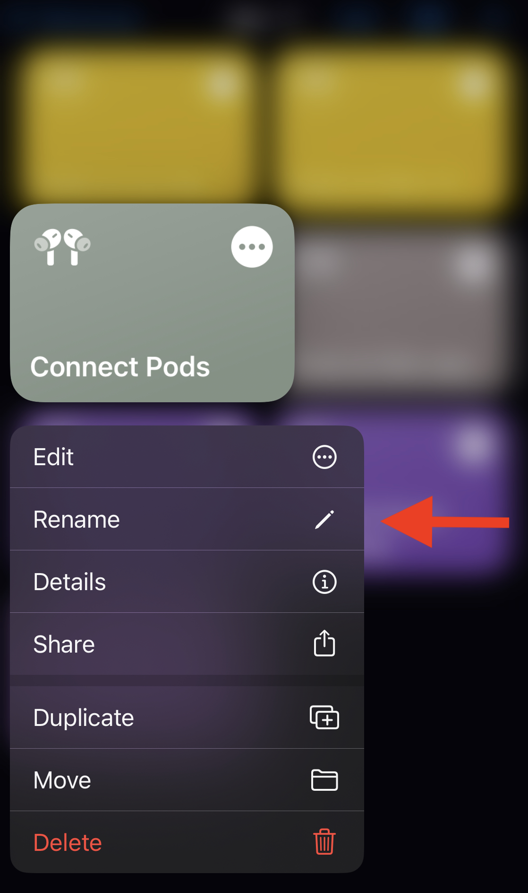
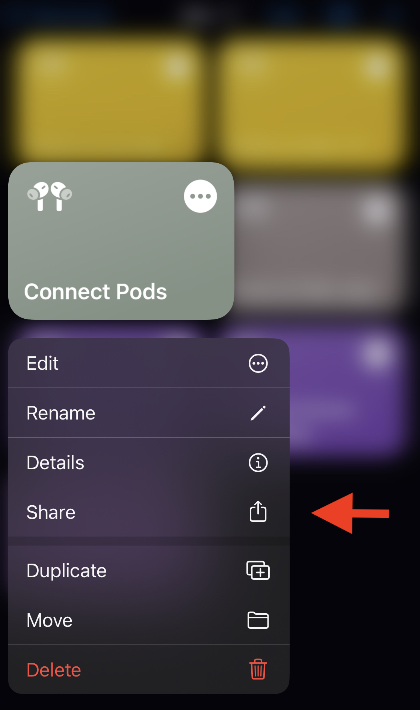

# iOS AirPods Connection Shortcut
Built for **iPhone** & **iPad**

This shortcut is a 1-Click and Siri Command solution for controlling which device your AirPods are connected to.

### Setup

1. [Download the Shortcut](https://www.icloud.com/shortcuts/ba9a4181176c4581b6157f24f3f70a8a)
2. You will be prompted to set the default volume level that will be set as the AirPods connect.
3. Put your AirPods in
4. In the second prompt you will be asked to select your AirPods from your device list.

### Customize
#### Siri Command
To use as Siri command, change the name of the shortcut to whatever you want to say to Siri.
1. Press and hold on the Shortcut
2. Select `Rename`
    

#### Add to your Home Screen
1. Press and hold on the Shortcut
2. Select `Share` and then select `Add to Home Screen`
   